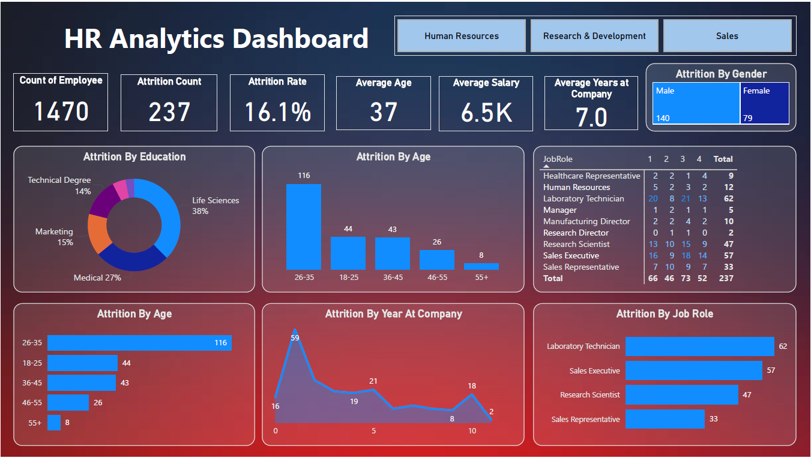

# HR Analytics Dashboard

## Overview
The **HR Analytics Dashboard** is an interactive visualization built using Power BI to analyze employee attrition trends across an organization. It provides insights into key metrics, including attrition rate, employee demographics, job roles, and other critical factors that influence workforce turnover.

## Key Features
- **Summary Metrics**:
  - Total employees: 1470
  - Attrition count: 237
  - Attrition rate: 16.1%
  - Average age: 37 years
  - Average salary: $6.5K
  - Average years at the company: 7.0 years
- **Demographic Insights**:
  - Attrition by gender
  - Attrition by age groups
  - Attrition by education fields
- **Attrition Breakdown**:
  - By job roles
  - By years at the company
  - By age groups

## Visual Components
1. **Header Section**: Displays high-level summary metrics and allows users to filter data by department (Human Resources, Research & Development, Sales).
2. **Attrition by Education**: A pie chart categorizing attrition based on fields of study (e.g., Life Sciences, Marketing, Medical, etc.).
3. **Attrition by Age**: A bar chart showing the distribution of attrition across age groups (e.g., 26–35 years).
4. **Attrition by Years at Company**: A line chart depicting trends in attrition based on tenure at the company.
5. **Attrition by Job Role**: Horizontal bar charts focusing on job roles with the highest attrition counts.
6. **Attrition by Gender**: A gender distribution chart displaying male and female attrition rates.
7. **Job Role Table**: A detailed table showing the breakdown of attrition across job roles and experience levels.

## Insights
- **Age Group**: The 26–35 age group has the highest attrition (116 employees).
- **Education**: Employees with a Life Sciences background contribute to the highest attrition percentage (38%).
- **Gender**: Male employees have a higher attrition count (140) compared to females (79).
- **Job Roles**: Laboratory Technicians and Sales Executives are among the job roles with the highest attrition rates.

